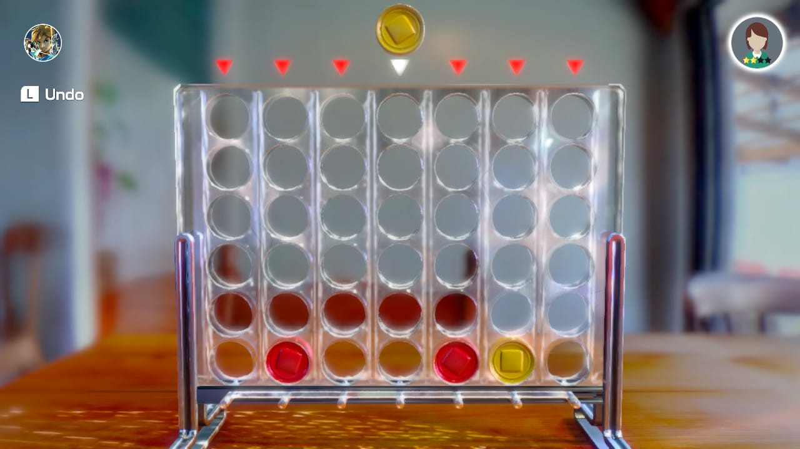
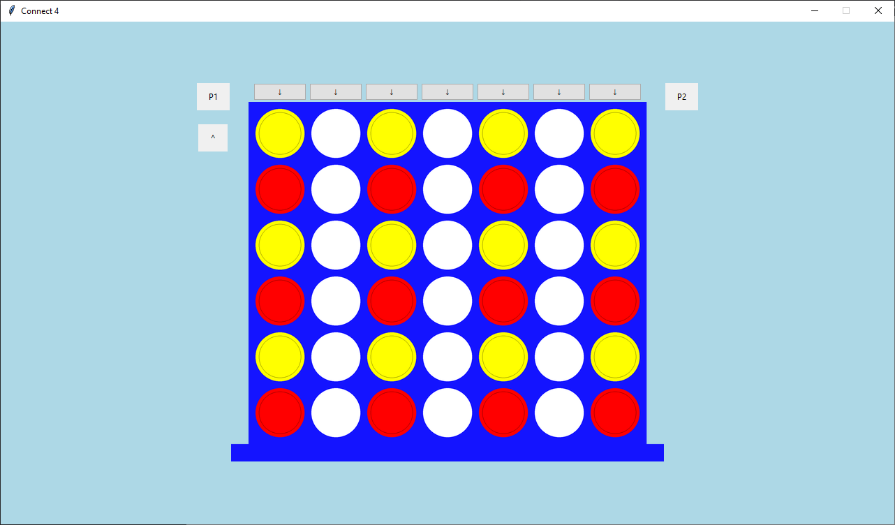
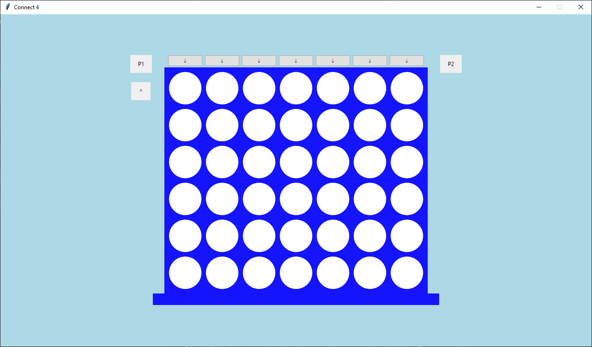
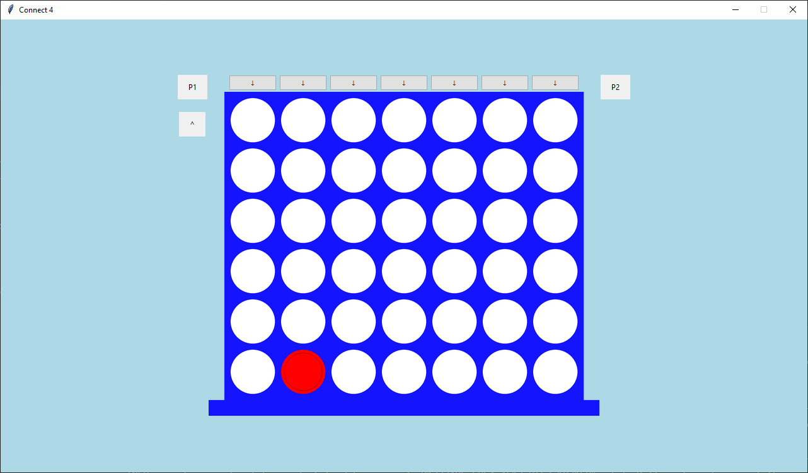
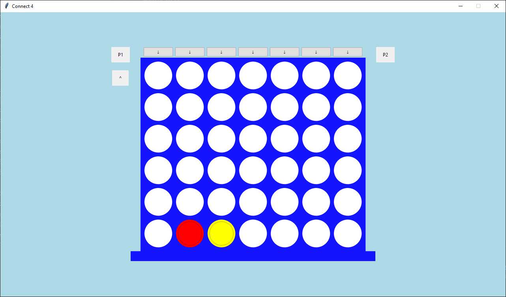
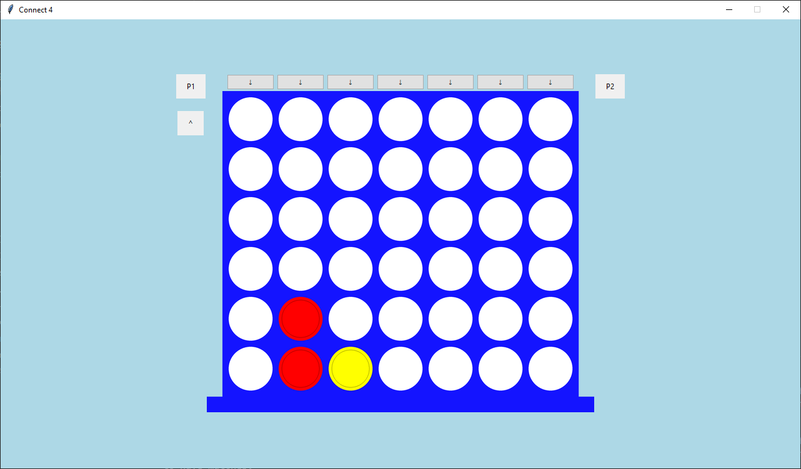
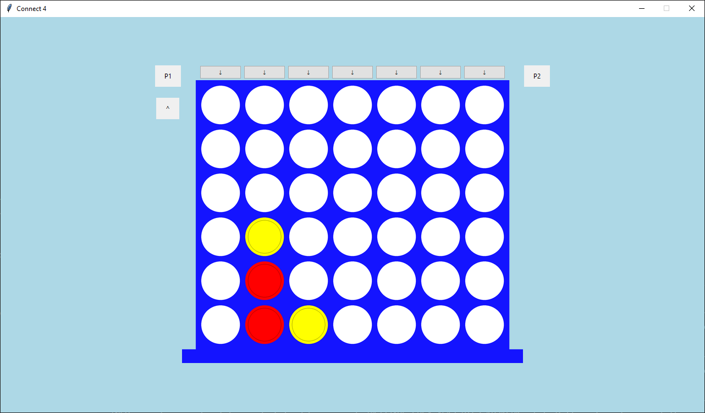
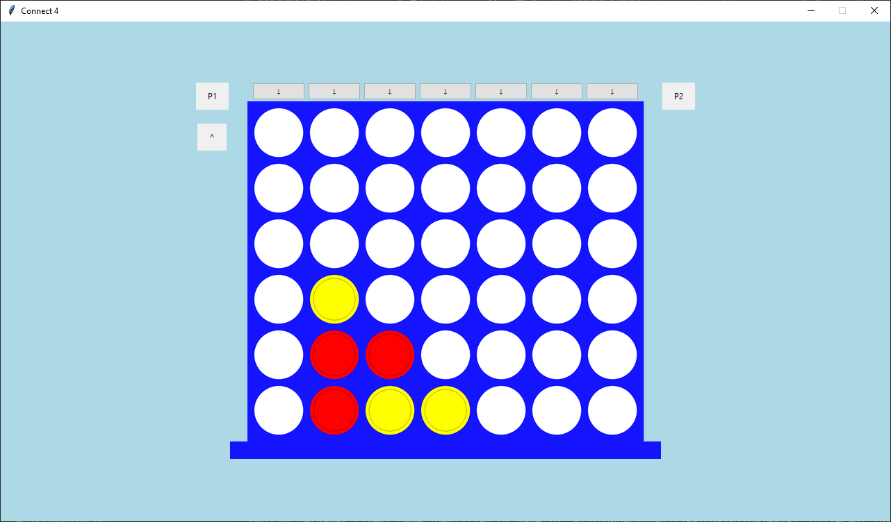
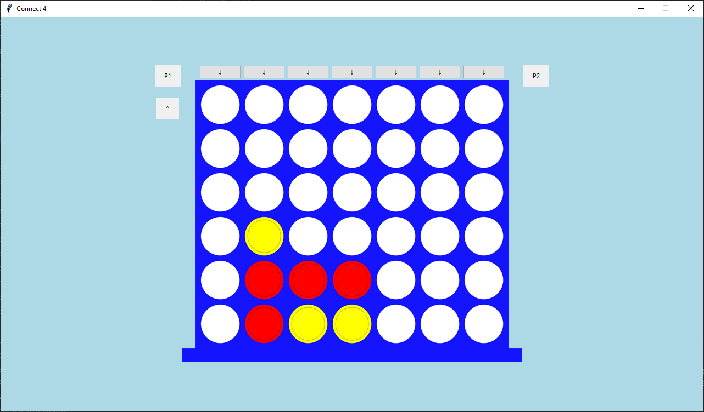
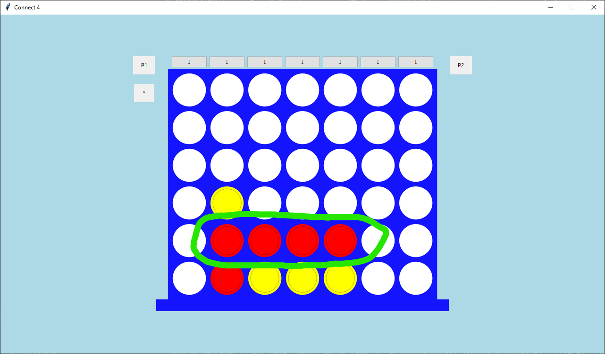

# Especificação de Requisitos

Projeto Connect4 Py-Netgames

## Intrudução

Este projeto visa desenvolver uma aplicação que permite 2 usuários remotos jogarem o jogo 'Connect 4'.

## Visão Geral

O projeto será desenvolvido com base em uma especificação UML e usará Python em conjunto com as seguintes bibliotecas:

- `py-netgames`: Responsável por cuidar da comunicação entre as duas máquinas remotas.
- `tkinter`: Responsável pela interface gráfica da aplicação.

## Requisitos de Software

### Requisitos Funcionais

1. **Iniciar Programa**: Ao ser executado, o programa deverá abrir em uma 'splash screen' e dar a opção do usuário de se conectar com o servidor `py-netgames`. Em caso de erro, o usuário deverá ser informado e o programa deverá fechar. Caso contrario, o usuário poderá procurar por uma partida.
2. **Procurar Partida**: O programa deverá deixar o jogador procurar por uma partida utilizando o sistema de matchmaking do `py-netgames`. Em caso de erro, o usuário deverá ser informado e o programa deverá deixar o usuário procurar por uma nova partida. Caso contrario, a ordem de turnos da partida será retornada do servidor, e o programa deverá mostrar a tela do jogo e iniciar a partida imediatamente.
3. **Colocar Peça**: Durante seu turno, o programa deverá deixar o jogador escolher uma coluna livre para soltar uma peça. Caso a peça feche uma linha de 4, o programa deverá mostrar uma mensagem de vitória, e um prompt para jogar outra partida. Caso contrário, o programa devera travar o jogador de qualquer tipo de ação até o programa receber uma jogada do openente.
4. **Receber Jogada**: Quando o `py-netgames` mandar uma notificação de que o oponente efetuou uma jogada, o programa deverá checar se a jogada fechou uma linha de 4, e neste caso o programa deverá mostrar uma mensagem de perda, e um prompt para jogar outra partida. Caso contrário, os controles do jogador deverão ser reabilitados.
5. **Empate**: Caso no seu turno ou no turno do oponente a partide chegue em um empate, o programa deverá mostrar uma mensagem de empate e um prompt para jogar outra partida.
6. **Notificação** de abandono: Quando o `py-netgames` mandar uma notificação de abandono, o programa deverá mostrar uma notificação de abandono e um prompt para jogar outra partida.

### Requisitos não Funcionais

1. Visual Paradigm será usado para o projeto UML.
2. Enquanto Tkinter será usado para a interface, alguns elementos serão importados através de assets, ou renderizados 'na mão' utilizando a biblioteca `PIL` (fork da biblioteca `Pillow`).
3. Interface do jogo será baseada na versão disponivel para Nintendo Switch no jogo Clubhouse 51. Segue comparacoes da inspiracao com o design inicial:

## Regras do Jogo

Connect 4 é um jogo de 2 jogadores onde cada jogador toma turnos colocando peças em uma matriz de
largura 6 e altura 7 funciona de forma similar ao jogo da velha, com exceção de que ao invés de uma
sequência de três na diagonal, vertical ou horizontal, é necessária uma sequência de 4 peças, as peças só
podem ser colocadas na posição mais inferior disponível de cada coluna, de forma que as peças "se
empilhem". Caso uma coluna fique cheia, ela não poderá ser escolhida para colocar uma peça.

Exemplo de uma partida:

Inicio de jogo:

Jogador 1 Escolhe a coluna 2:

Jogador 2 Escolhe a coluna 3:

Jogador 1 Escolhe a coluna 2:

Jogador 2 Escolhe a coluna 2:

Jogador 1 Escolhe a coluna 3:

Jogador 2 Escolhe a coluna 4:

Jogador 1 Escolhe a coluna 4:

Jogador 2 Escolhe a coluna 5:

Jogador 1 Escolhe a coluna 5:

Linha de 4 fechada, jogador 1 ganha o jogo:

